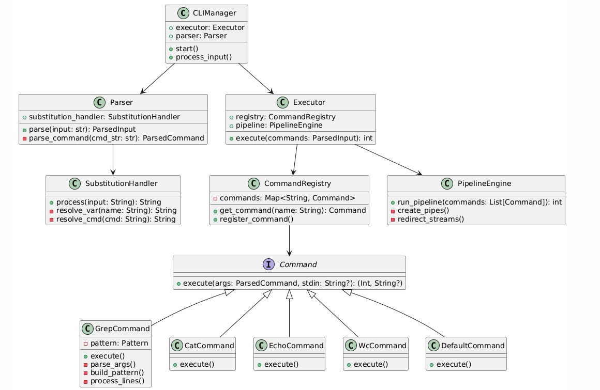

# Расширенная архитектура CLI интерпретатора

1. Пользовательский ввод → CLIManager
2. CLIManager → Parser (разбор команды)
3. Parser → Executor (передача ParsedInput) 
4. Executor ↔ CommandRegistry (получение обработчиков)
5. Executor → PipelineEngine (управление пайпами)
6. PipelineEngine ↔ Команды (исполнение в процессах)
7. Результат → CLIManager → Пользователю

## Описание

* `CLIManager`
  * Управляет интерпретатором, запускает парсинг и исполнение команд
* `Parser`
  * Парсит входную строку на токены, учитывая заданные требования
  * Результат функции `parse` - список списков. Каждый из списков - команда, разделенная на токены, команды разделены пайплайном. Например:
    * `parse("echo 123") -> [["echo", "123"]]`
    * `parse("echo 123 | wc") -> [["echo", "123"], ["wc"]]`
* `Executor`
  * Получает команды из `Parser` и выполняет их
  * Для этого используются:
    * `Command`
      * Интерфейс для известных команд
      * `execute(args: list[str])` - функция для исполнения команды, разбитой на токены
    * Для известных команд (`cat, echo, wc, pwd, exit`) есть соответствующие классы, реализующие интерфейс `Command` (например, `CatCommand`)
    * Для неизвестных команд класс `DefaultCommand`, который исполняет эту команду как внешнюю программу
  * Для осуществления работы с пайплайнами используются `fork()` и `pipe`

* `Pipes`
  * Технологии:

    * os.fork() - создание процессов

    * os.pipe() - межпроцессное взаимодействие

    * os.dup2() - перенаправление потоков

* Схема выполнения:

  

* `Substitunions`
* Поддерживаемые форматы:
  * 1. Простые: $HOME
 
  * 2. Фигурные скобки: ${PATH}

  * 3. Командная подстановка: `date`

* Алгоритм обработки
  * 1. Сканирование строки на шаблоны

  * 2. Поиск значений в:

    * 1. Окружении (os.environ)

    * 2. Кэше интерпретатора

    * 3. Результатах выполнения команд

  * 3. Замена с учетом экранирования (\$)  
